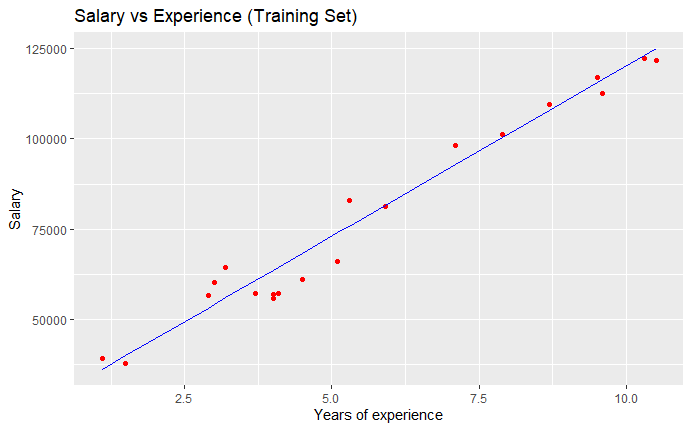
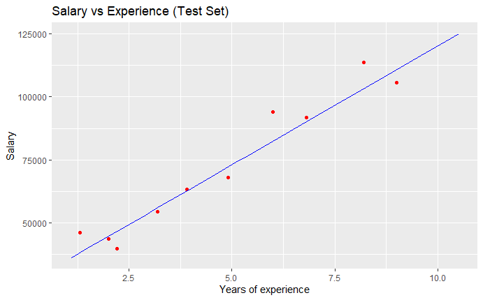

<p align="center">
    
</p>

<H2><p align="Center">TECNOLÓGICO NACIONAL DE MÉXICO</p></H2>

<H2><p align="Center">INSTITUTO TECNOLÓGICO DE TIJUANA</p></H2>

<H2><p align="Center">SUBDIRECCIÓN ACADÉMICA</p></H2>

<H2><p align="Center">DEPARTAMENTO DE SISTEMAS Y COMPUTACIÓN</p></H2>

<H2><p align="Center">NOMBRE DE LOS ALUMNOS: </p></H2>

<H2><p align="Center">MADRIGAL RAMOS ULISES OMAR 18210496</p></H2>

<H2><p align="Center">LOZANO ALVAREZ MARCO POLO 18210846 </p></H2>

<H2><p align="Center">Carrera: Ing. Sistemas computacionales</p></H2>

<H2><p align="Center">MATERIA: Minería de datos</p></H2>

<H2><p align="Center">PROFESOR: JOSE CHRISTIAN ROMERO HERNANDEZ</p></H2>

<H2><p align="Center">TRABAJO: Práctica 1 - Unidad 3</p></H2>


<br>
<br>
<br>
<br>

# Practice 1 - Unit 3
In this practice we have a Salary_Data database which contains the following data (YearsExperience and Salary), the linear regression machine learning model will be displayed and analyzed

# Code:
```R
# Importing the dataset
dataset <- read.csv('Salary_Data.csv')

# Splitting the dataset into the Training set and Test set
# Install.packages('caTools')
library(caTools)
set.seed(123)
split <- sample.split(dataset$Salary, SplitRatio = 2/3)
training_set <- subset(dataset, split == TRUE)
test_set <- subset(dataset, split == FALSE)

# Fitting Simple Linear Regression to the Training set
regressor = lm(formula = Salary ~ YearsExperience,
               data = dataset)
summary(regressor)

# Predicting the Test set results
y_pred = predict(regressor, newdata = test_set)

# Visualising the Training set results
library(ggplot2)
ggplot() +
  geom_point(aes(x=training_set$YearsExperience, y=training_set$Salary),
             color = 'red') +
  geom_line(aes(x = training_set$YearsExperience, y = predict(regressor, newdata = training_set)),
            color = 'blue') +
  ggtitle('Salary vs Experience (Training Set)') +
  xlab('Years of experience') +
  ylab('Salary')
```


```R
# Visualising the Test set results
ggplot() +
  geom_point(aes(x=test_set$YearsExperience, y=test_set$Salary),
             color = 'red') +
  geom_line(aes(x = training_set$YearsExperience, y = predict(regressor, newdata = training_set)),
            color = 'blue') +
  ggtitle('Salary vs Experience (Test Set)') +
  xlab('Years of experience') +
  ylab('Salary')
```


# Conclusion
In conclusion, the practice was executed successfully, we can perceive that the YearsExperience and Salary data are associated, since the more years of experience the more salary the employee has
